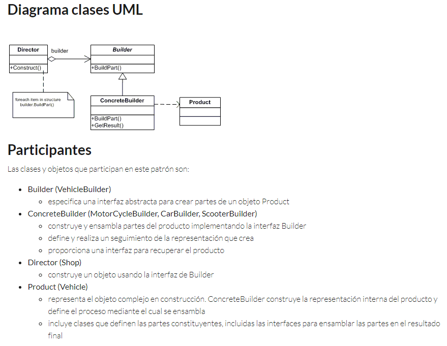

# Java - Patterns
## Builder

This pattern separates the construction of a complex object from its representation so that the same construction process can create different representations

Here we build a complex object in a way with different representations, but without the code being coupled and without calling each other.

The frecuency of use is: Middle-Low 2/5

This project is an implementation of what was learned in the course: https://openwebinars.net/academia/portada/solid-patrones-diseno/