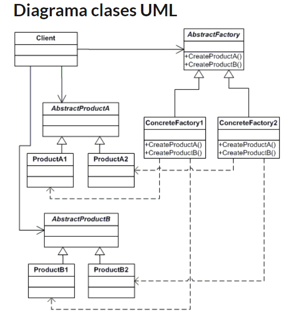
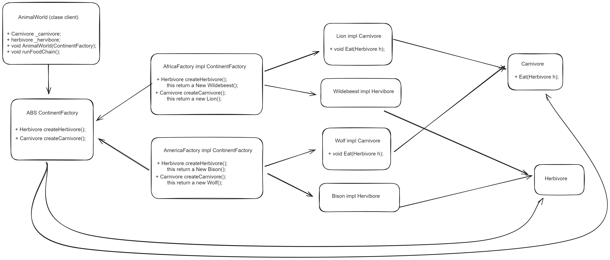
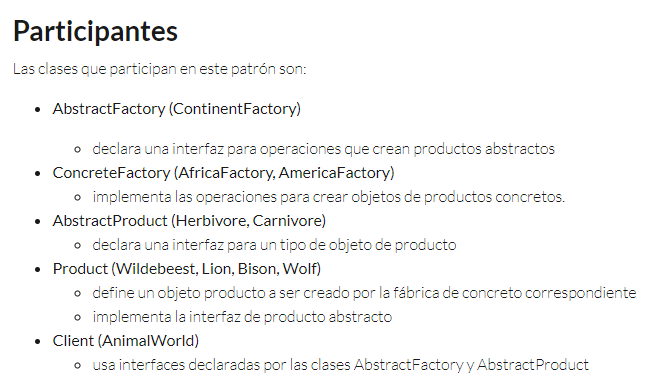

# Java - Patterns
## Abstract Factory

This pattern provides an interface for creating a family of related or dependent objects without specifying their concrete classes.

The frecuency of use is: High 5/5

 

This project is an implementation of what was learned in the course: https://openwebinars.net/academia/portada/solid-patrones-diseno/